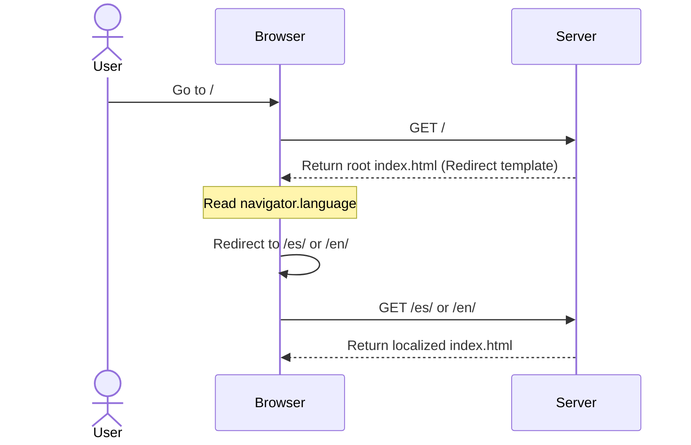
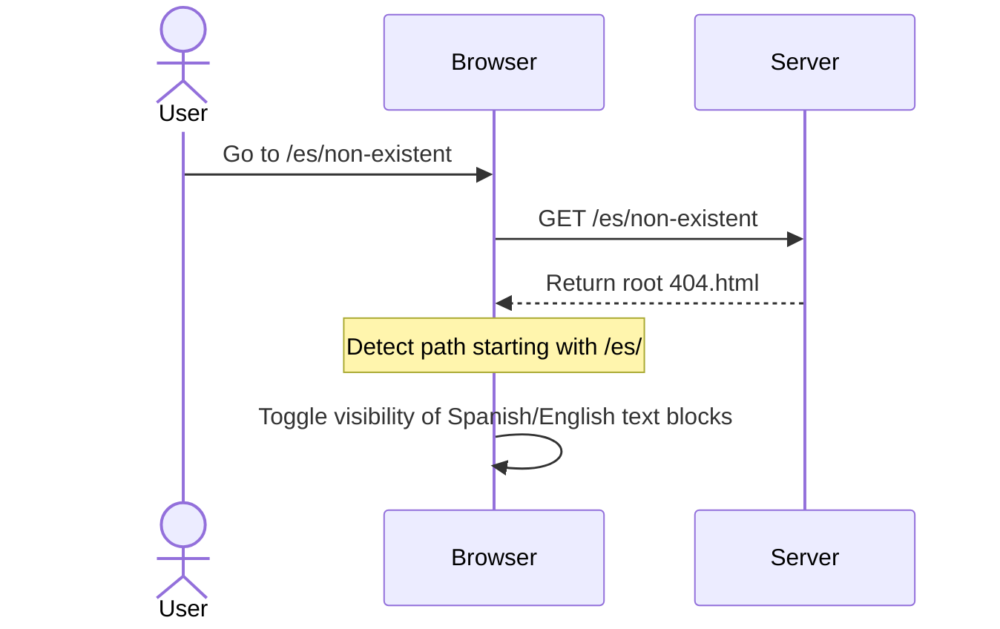

# Design: Implement i18n

## Technical Approach

We will implement native multilingual support using Astro's built-in i18n capabilities for metadata and SEO, combined with a dynamic routing strategy (`src/pages/[lang]/index.astro`) and a custom client-side redirection script at the root (`src/pages/index.astro`). A lightweight i18n helper (`src/libs/i18n.ts`) will manage the translation dictionary.

## Architecture Decisions

| Option | Tradeoff | Decision |
|--------|----------|----------|
| **Routing Strategy**: Dynamic params `[lang]` vs Explicit subdirectories `/es/`, `/en/` | Dynamic params keep code DRY and highly maintainable; explicit subdirectories lead to massive template duplication. | **Dynamic route (`[lang]/index.astro`)** for main rendering. |
| **Root Redirection**: SSR/Edge middleware vs Client-side JS redirect | Middleware requires SSR adapter/server host; client-side JS works on static hosting (SSG) with minimal performance overhead. | **Client-side JS redirect in `index.astro`** based on `navigator.language`. |
| **404 Localization**: Multipage (`/[lang]/404.html`) vs Single `/404.html` with client toggle | Multipage relies on complex hosting configuration; single file is supported out-of-the-box by static hosts and uses client JS to toggle elements. | **Single root `404.astro`** with CSS-hidden blocks toggled via client-side path parsing. |
| **Translation helper**: 3rd-party library vs custom typed helper | 3rd-party libs add bundle size and complexity; a custom TS helper is lightweight, fully typed, and has zero dependencies. | **Custom helper (`src/libs/i18n.ts`)** with key fallback. |

## Data Flow

### Root Redirection Flow



### 404 Localization Flow



## File Changes

| File | Action | Description |
|------|--------|-------------|
| `astro.config.mjs` | Modify | Add `i18n` configuration block defining `locales` and `defaultLocale`. |
| `src/libs/i18n.ts` | Create | Dictionaries for `en` and `es`, and functions `getLangFromUrl` / `useTranslations`. |
| `src/pages/index.astro` | Modify | Replace layout content with a lightweight script to redirect the client based on browser locale. |
| `src/pages/[lang]/index.astro` | Create | Dynamic page mapping both locales using `getStaticPaths()`. Serves the original page structure. |
| `src/layouts/Layout.astro` | Modify | Accept dynamic `lang` prop, dynamically render HTML attributes, and insert alternate SEO hreflang links. |
| `src/components/IntroCard.astro` | Modify | Inject `useTranslations` and update static copy to use `t()`. |
| `src/components/AboutMe.astro` | Modify | Inject `useTranslations` and update static copy to use `t()`. |
| `src/components/Contacts.astro` | Modify | Inject `useTranslations` and update static copy to use `t()`. |
| `src/components/TimeZoneCard.astro` | Modify | Inject `useTranslations` and translate title. |
| `src/components/Now.astro` | Modify | Inject `useTranslations` and update static copy to use `t()`. |
| `src/components/Blog.vue` | Modify | Update to receive `lang` prop and translate the screen-reader label. |
| `src/pages/404.astro` | Modify | Create two message blocks (ES and EN) toggled via client-side inline script. |

## Interfaces / Contracts

```typescript
// src/libs/i18n.ts
export type Locale = 'en' | 'es';

export interface TranslationSchema {
  [key: string]: string;
}

export function getLangFromUrl(url: URL): Locale;
export function useTranslations(lang: Locale): (key: string) => string;
```

## Testing Strategy

| Layer | What to Test | Approach |
|-------|-------------|----------|
| Unit | Translation helpers in `src/libs/i18n.ts` | Verify correct locale parsing from URL and fallback behavior for missing keys. |
| Integration | Build verification via `astro check` | Run `pnpm build` to verify that dynamic page generation maps `/en/` and `/es/` correctly. |
| Manual | Redirection and 404 toggle | Verify browser redirection to `/es/` and path-based 404 updates. |

## Migration / Rollout

No migration required. Rolling back entails reverting the workspace changes via Git.

## Open Questions

- None.
